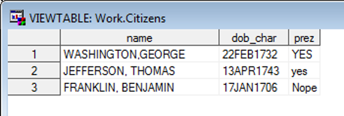
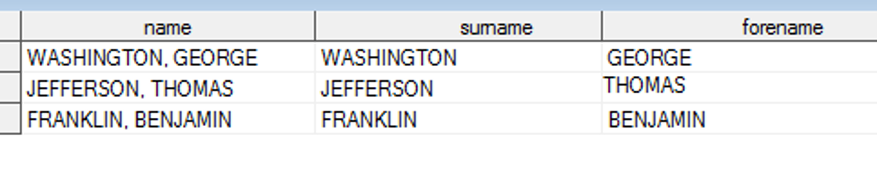
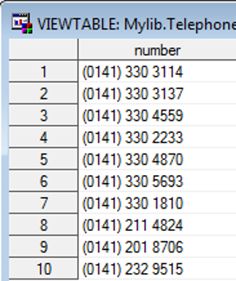
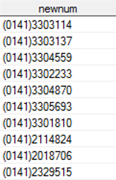
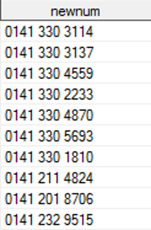

## Table of contents

  * [Important Tips](#important-tips)
  * [Importing Libraries](#importing-libraries)
    + [Importing your datasets](#importing-your-datasets)
    + [Converting other extensions - csv, excel, etc.](#converting-other-extensions---csv--excel--etc)
- [Data Statements](#data-statements)
    - [Using Operators](#using-operators)
    - [IF statements](#if-statements)
    - [Merging Datasets](#merging-datasets)
        - [Merge](#merge)
        - [Appending](#appending)
    - [Outputting subsets](#outputting-subsets)
    - [Converting numeric to character and viceversa](#converting-numeric-to-character-and-viceversa)
        - [PUT: Numeric to character](#put-numeric-to-character)
        - [INPUT: Character to numeric](#input-character-to-numeric)
    - [Data Cleaning](#data-cleaning)
        - [UPCASE() and LOWCASE() : convert all characters to upper or lower-case](#upcase-and-lowcase--convert-all-characters-to-upper-or-lower-case)
    - [Substring](#substring)
    - [Scan](#scan)
    - [Tranwrd()](#tranwrd)
    - [Compress](#compress)
    - [Concatenation](#concatenation)
- [Variables](#variables)
    - [Variable Names](#variable-names)
        - [Rules for variable names:](#rules-for-variable-names)
        - [Example of __valid__ variable names:](#example-of-valid-variable-names)
        - [Example of __invalid__ variable names:](#example-of-invalid-variable-names)
    - [Renaming variables](#renaming-variables)
    - [Data Types](#data-types)
- [Procedures](#procedures)
    - [proc contents](#proc-contents)
        - [Required syntax](#required-syntax)
        - [Optional](#optional)
    - [proc freq](#proc-freq)
        - [Required syntax](#required-syntax-1)
        - [Optional](#optional-1)
    - [proc means](#proc-means)
    - [proc format](#proc-format)
    - [Applying formats](#applying-formats)
        - [Formats already built in SAS](#formats-already-built-in-sas)
            - [Numeric formats:](#numeric-formats)
            - [Character formats:](#character-formats)
            - [Date and time formats:](#date-and-time-formats)
    - [proc print](#proc-print)
    - [Labels](#labels)
    - [proc copy](#proc-copy)
    - [proc sort](#proc-sort)
- [Macros](#macros)
- [ODS](#ods)
- [Extra](#extra)
    - [Comments in SAS](#comments-in-sas)

## Important Tips
* SAS is case insensitive, so it's the same to do `proc contents` and
`PROC CONTENTS`. However, it's always advised to keep consistency
* When referrencing a library, you will use `{folder}`.`{dataset}`, 
where
    * `{folder}` is the name you specified when you imported the library
via `libname`
    * `dataset` is the name of your dataset.


## Importing Libraries

For SAS, a data library is a set of files (`.sas7bdat`) that are stored in the same physical location of a comptuter. We need to tell SAS the physical location of the datasets you're going to read from.

### Importing your datasets
```
libname mylib "C:\My Code\My Folder";
```

### Converting other extensions - csv, excel, etc.
Instructions:  
* Use `File -> Import Data`. Ensure you save the SAS code, and can read it in and run it:

```sas
proc import out=outlib.mydataset 
        datafile="C:\My Code\My Folder\example.csv" 
        dbms=csv replace;
    getnames=yes;
    datarow=2; 
run;
```

For further details about libraries, [click here](libname.md).

------------------------

# Data Statements
```sas
/* 
    The following code will create a new dataset called *dataset_output*
    concatenating the two sources (dataset_source_1 dataset_source_2).
    It will also add a new column monthly_sales.
*/

data dataset_output;
    set dataset_source_1 dataset_source_2;

    monthly_sales = daily_sales * 1.1;
run;
```

```sas
/*
	The following code will delete all the variables from orion.nonsales but salary and hire_date.
*/
data nonsales2;
	set orion.nonsales;
	keep salary hire_date;
run;

/*
	The following code will delete salary and hire_date from orion.nonsales.
*/
data nonsales2;
	set orion.nonsales;
	drop salary hire_date birth_date;
run;


/* 
    The following code will create a new dataset called *dataset_output*
    from the contents of the dataset dataset_source.
    It will also rename the column countri to country. 
*/
data dataset_output;
    set source.dataset_source(rename = (countri = country));
run;
```

```sas
data dataset_output;
    set source.dataset_source;

    /* The code below will concatenate two columns */
    name = catx(' ', first_name, last_name);

    /* The code below will set the column classroom */
    if student_points < 10 and student_points ne . then classroom = 1;
    else if student_points >= 10 then classroom = 2;
    else classroom = 3;

    /* The code below will set the column is_married */
    if is_married ne "yes" then is_married = 'no';

    /* The code below will set the column winner and also change money */
    if points > 100 then do;
        winner = 'Yes';
        money = money * 0.9;
    end;
    else winner = 'No';

    /* Change car_name to only keep [] in the column */
    car_name = compress(car_name, "[]", "k");

    /* Change car_model to remove all spaces */
    car_model = compress(car_model, " ");

    /* Adding a new column of type date */
    date_of_birth = mdy(date_of_birth_month, date_of_birth_day, date_of_birth_year);

    format date_of_birth worddatx.;
    format money dollar10.;

    /* The code below will filter the dataset so only rows where first word in city = boston are retrieved */
    where upcase(scan(city, 1, ' ')) = 'BOSTON';

    /* The code below will convert state to uppercase */
    state = upcase(state);

    drop student_temp_score;
run;
```
## Using Operators
The following are the operators:

| Symbol | Definition |
|--------|--------------------------|
| + | Add |
| - | Subtract |
| * | Multiply |
| / | Divide |
| ** | Power |
| sqrt() | Square root |
| & and | AND |
| | or | OR |
| ^ not | NOT |
| = eq | equal |
| ^= ne | not equal |
| > gt | greater |
| >= ge | greater than or equal to |
| < lt | less than |
| <= le | less than or equal to |
| in |  |
| not in |  |

We can use them in conjuction with an IF statement.

## IF statements

We can use the syntax if... then
``sas
data x;
set x;
if bmi < 18.5 and bmi ne . then wt_status = 1;
else if bmi >= 30 then wt_status = 4;
run;
``

``sas
data nonsales;
	set orion.nonsales;
	if country in ("au" "AU") then countrytext = "Australia";
	else if country in ("us" "US") then countrytext = "United States";
run;
``

or we can use the syntax if... then do; a; b; end; .

```sas
data example_dsn1;
	set example_dsn1;
	if bmi < 18.5 and bmi ne . then do; 
	wt_status = 1;
	wt_cat = "Underweight";
	end;
run;
```
Note that we are filtering out the NAs as SAS considers them a really small number.

A common error is:
forgetting to close an if then do with an ***end***.

## Merging Datasets

For merging datasets, it's **important** that you sort first! Otherwise there will be missing rows from the second dataset. See `proc sort`

### Merge
``merge`` combines the data sets by column using a common column as a reference.
```sas
data dataset_example;
    merge dataset1 dataset2;
    by id;
run;
```

```sas
/*
    The code below will only include rows if they exist in b.
*/    
data dataset_example;
    merge dataset1(in = a) dataset2(in = b);
    by id;
    if b;
run;
```

### Appending
``
*This code will add the entries of v1 into b1 by row;
data combined_dataset;
	set b1 v1;
run;
``

## Outputting subsets
If then ... output
``sas
data australia_sales;
	set orion.nonsales;
	if country in ("au" "AU") then output;
run;
``

``sas
data australia_sales2;
	set orion.nonsales;
	if country not in ("au" "AU") then delete;
run;
``
Missing data will __not__ be output, since it's ``not in``.

*Errors:*
Describing NAs as . when for variables they are " " .

``
data australia_sales2;
	set orion.nonsales;
	if country in ("au" "AU") or country = . then delete;
run;
``
## Converting numeric to character and viceversa
### PUT: Numeric to character

```sas
data example_dsn1;
	set example_dsn1;
	id2 = put(id, 3.);
run;
* 3. is the format to be used;
```
The new character variable is left-justified with leading spaces.
Stripping out white space could be vital for ensuring a correct merge.  “     1” is not the same as “1”. 
To convert without leading spaces:

```sas
data convert_ex;
	set convert_ex;
	id2 = strip(put(id, 3.));
run;
```
This picture shows us how the numbers have been converted to characters. Look at the justification. 


### INPUT: Character to numeric
```
data example_dsn1;
	set example_dsn1;
	weight2 = input(weight, best12.);
run;
*
The informat relates to the appearance of the variable before conversion.  For ‘standard’ numbers, best12. (or bestw.) is usually sufficient.
;
```
Other informats are:


## Data Cleaning
### UPCASE() and LOWCASE() : convert all characters to upper or lower-case

```
data males;
	set alldata;
	if upcase(sex) = 'MALE' then output;
run;

data males;
	set alldata;
	if lowcase(sex) = ‘male' then output;
run;
```
or
```
data males;
	set alldata;
	if upcase(sex) ^= 'MALE' then delete;
run;
```


Let's say our tables don't display properly because there are lower-case elements etc.
```
data alldata;
	set alldata;
	sex = lowcase(sex);
run;

proc freq data = alldata;
	table sex;
run;
```
## Substring
Syntax: ``substrn(source, startposition, length)``
To extract year of birth from dataframe:

```data citizens;
	set citizens;
	yob = substrn(dob_char, 6, 4);
run;
```
```
data presidents;
	set citizens;
	if upcase(substrn(prez, 1, 1)) = "Y" then output;
run;
```
NOTE: DO NOT USE `substr` but `substrn` as the former is better.

## Scan
Syntax: ``scan(var,n,’ ’)``

```
data citizens;
	set citizens;
	surname = scan(name, 1, ',');
	forename = scan(name, -1, ' ');
	keep name surname forename;
run;

*The third argument " " means to continue until there.
```




## Tranwrd()

Syntax:  ``tranwrd(source, target, replacement)``

```
*This code replaces Sales with Selling in the Job_title column;

data sales;
	set orion.sales;
	new_job_title = 
		tranwrd(job_title, 'Sales', 'Selling');
run;
```
## Compress
Compress either:
- removes certain (specified) characters from a character string
- removes certain types of characters (when one or more modifiers are used)
- if no characters are specified, removes spaces



```
data telephone;
	set mylib.telephone;
	newnum = compress(number);
run;
*Since variable is the only argument, it removes all spaces;
```


```
data telephone;
	set mylib.telephone;
	newnum = compress(number, "()");
run;

*It removes everything within the quote marks.;
```



The following:
``newnum = compress(number, "() ");`` would remove all curved brackets and blank spaces.

``newnum = compress(number, , 'kd');`` would remove all characters and only keep the numeric.

Modifiers:

Modifier | Function
---------|---------
a | Remove all upper and lower case characters from string
ak | Keep only alphabetic characters from string
kd | Keep only numeric characters
d | Remove numeric values
i | Remove specified characters both upper and lower case
k | Keep the specified characters instead of deleting them
l | Remove lower case characters
p | Remove punctuation
s | Remove spaces (default)
u | Remove uppercase characters


## Concatenation
Function | Explanation
------- | -------
cat() | Concatenates character strings without removing leading or trailing blanks
catx() | Concatenates character strings, removes leading and trailing blanks, and inserts separators
catt() | Concatenates character strings and removes trailing blanks
cats() | Concatenates character strings and removes leading and trailing blanks, no separators

```
data shipping_notes;
	set orion.shipped;
	length comment $21;
	comment = cat('Shipped on ', put(ship_date, mmddyy10.));
	total = quantity * input(price, dollar7.2);
	format quantity words.;
run;

*\ 
Saves new dataset in work library called shipping_notes.
Reads dataset from orion library called shipped.
Sets length of new variable called comment to 21 characters.
Concatenates ‘Shipped on ‘ and the ship_date (after converting to character with put function using mmddyy10. format) keeping leading and trailing blanks and puts into new variable called comment.
Calculates variable total which is equal to the variable quantity multiplied by the price (after converting to numeric using dollar7.2 informat).
Includes format on the variable quantity using the format words.

\*
```


------------------------
# Variables

## Variable Names
### Rules for variable names:
* It cannot start with a number
* It cannot contain full stops or else SAS will go look for it in a certain library
* It needs to begin with an English letter or underscore.
* It should ***only*** contain letters, numbers, or underscores. (no spaces or other symbols)
* The maximum length is 32 characters.

### Example of __valid__ variable names:
* ``VAR1``
* ``Var1``
* ``December_2007``
* `` _count_ ``

### Example of __invalid__ variable names:
* ``DateDD/MM/YY``
* ``ThisVariableHasMoreThan32Characters``
* ``1st_SBP_measure``
* ``December.2007``

## Renaming variables
```sas
data orion.file;
set orion.file(rename = (newname=oldname));
run;
```

or

```sas
data orion.file;
set orion.file;
newname=oldname;
drop oldname;
run;
```

**Problems:**
If we rename the variables, we cannot use their old names to perform operations on them, even inside the snippet of code..
```sas
data example_dsn1;          	
	set example_dsn1(rename = (var1 = v1 var2 = v2));
	var3 = var2 + var1;
run;

*var2 and var1 no longer exist, they have been renamed as v2 and v1.;
```

## Data Types
Variables in SAS can be of 2 types:
* Numeric
	- NAs are shown as ``.``
	- Right-justified by default
* Character
	- NAs are shown as a blank cell
	- Left-justified by default

To find out the data type of a variable:
- The above-mentioned defaults can be used to deduce whether one variable is a character string or numeric.
- We can double click on a column.
- We can use ``proc contents``.

A special type of numeric variable is [dates](dates.md).

------------------------ 
# Procedures

Per [documentation](http://support.sas.com/documentation/cdl/en/lrcon/62955/HTML/default/viewer.htm#a000992094.htm) the PROC step consists of a group of SAS statements that call and execute a procedure. It's basically a way to ask SAS to perform some defined action. 

## proc contents

This procedure describes the contents of a dataset and prints the directory of the SAS library. Basically it's a way to know the structure of a dataset.

**Syntax:**

```sas
proc contents data = mylib.dataset_example order = varnum;
run;
```

```sas
proc contents data = mylib.dataset_example out=mydata (keep= name varnum) noprint varnum;
run;
```

### Required syntax
* `proc contents` is the procedure name
* `data` is the way to specify the source where you want the information from
* `mylib.dataset_example` is the dataset source
* `run;` Ends the procedure

### Optional
* `order = varnum` option will display the variables in order, rather than alphabetically
* `varnum` this is another way of setting the [option](https://support.sas.com/documentation/cdl/en/statug/63033/HTML/default/viewer.htm#statug_freq_sect010.htm) the order of the variables.

Which will generate the following output:  


------------------------

## proc freq
```sas
proc freq data = mylib.dataset_example;
    table gender / nocum nopercent norow nocol;
run;
```

```sas
proc freq data = mylib.dataset_example;
    table gender * location;
run;
```

```sas
ods noproctitle;
proc freq data = mylib.dataset_example;
    title "Example table";
    table gender;
    where location = "MX";
run;
```

### Required syntax
* `proc contents` is the procedure name
* `data` is the way to specify the source where you want the information from
* `mylib.dataset_example` is the dataset source
* `run;` Ends the procedure

### Optional
* Supressing Information
Several options can be specified after setting the tables adding `/`, i.e. (`table gender / nocum nopercent`)
    * `norow`
    * `nocol`
    * `nocum` Removes the Cumulative Frequency / Percentage
    * `nopercent` Removes the Percentage. [Documentation](https://support.sas.com/documentation/cdl/en/statug/63033/HTML/default/viewer.htm#statug_freq_sect010.htm)
* Filtering can be done through `where` clause


*Common errors:*
using class in proc freq
```
proc freq data = orion.customer;
	class gender;
	table country;
run;
```
------------------------

## proc means
```sas
proc means data = mylib.dataset_example;
    var age;
run;
```

```sas
proc means data = mylib.dataset_example min max mean clm maxdec = 1;
    class gender;
    var age;
run;
```

*Common errors:*
proc means with a character variable:
```
proc means data = orion.staff mean clm;
	var job_title;
run;
```
------------------------

## proc format
```sas
proc format;
    value rating 1 = 'Very Good'
        2 = 'Good'
        3 = 'Neutral'
        4 = 'Bad';
run;
```

```sas
proc freq data = mylib.dataset_example;
    table overall_rating;
    format overall_rating rating.;
run;
```

```sas
proc format;
    value $shape_format 
        "circle" = "Circle"
        "CIRCLE" = "Circle"
        "rectangle" = "Rectangle"
        "RECTANGLE" = "Rectangle";
run;
*The dollar sign in SAS signifies a character.  This sets up a format “grpcfmt”, which can be applied to a character variable.;
```

```sas
proc format;
	value agegrp 	low - < 10 = "Below 10"
				10 - < 20 = "10 to below 20"
				20 - <30 = "20 to below 30"
				30 - high = "30 or above";
run;
*low and high are the lowest and the highest number present.
This code says: apply the format from 10 to 20(excluded), ... ;
```

```sas
proc freq data = mylib.dataset_example;
    table shape;
    format shape $shape_format.;
run;
```
## Applying formats
To apply the format, use
``format variable fmt.;`` in e.g. a proc print.

### Formats already built in SAS
#### Numeric formats:
**format**. |  | **Format**Widthofwholenumber.0decimals | **Format**Widthofwholenumber.nodecimals
------- | ------- | ------- | -------
w. |  |  | w.d
best. (this show decimals)|  | bestw. |  | bestw.d
comma. |  | commaw. |  | commaw.d
dollar. |  | dollarw. | dollarw.d
Note that the width includes the dot. *2.1* has a width of 3. If I styled *34.2* with a 2.1 format, I would get *34*.

Clearly the width (the length of the whole number) has to be greater than the number of decimals, otherwise we get an error.

#### Character formats:
| format |
|--------|
| $w. |

#### Date and time formats:
SAS value | Format | We see
----------|--------|-------
20752 | date9. | 25Oct2016
20752 | worddatx. | 25 October 2016
57600 | timeampm9. | 4:00 PM
57600 | time. | 16:00:00

------------------------

## proc print
```sas
proc print data = nonsales;
	where country in ("au" "AU");
run;
```

```sas
options nocenter;
proc print data = dataset_example label;
    var student_id name graduation_date savings;

    format savings dollar10. graduation_date date9.;
    title "My first title";
    title2 "My second title";
    footnote1 "Leave a footnote 1";
    footnote2 "Leave a footnote 2";

    label student_id = "Student ID" 
        name = "Full Name"
        graduation_date = "Graduation Date" 
        savings = "Savings";

    where graduation_date ge '01Feb2000'd and graduation_date le '30Nov2010'd;
run;
```

*Problems:*
```sas
*No titles are printed because title; in the proc print resets all the titles;
title1 "An example title 1";
title2 "This is title 2";
title3;

proc print data = orion.sales(obs = 5);
	var employee_id first_name last_name salary;
	title;
run; 
```

```
*Proc means has the title of the previous procedure. We need to reset title; ;
proc print data = orion.sales(obs = 5);
	var employee_id first_name last_name salary;
	title1 "Names and salaries of ORION employees";
run; 

proc means data = orion.sales mean std median q1 q3;
	var salary;
run; 

```

## Labels
Labels change the appearance of variable names (but __do not__ rename them), as opposed to formats which change the appearance of variable values.

To use them:
<pre>
proc print data=orion.sales <b>label</b>;
   var Employee_ID First_Name Last_Name Salary;
   <b>label Employee_ID="Sales ID" 
         First_Name="First Name"
         Last_Name="Last Name" 
         Salary="Annual Salary";</b>
   format Salary dollar8.;
   where Salary > 80000;   
   by Country;
run;
</pre>

------------------------

## proc copy
```sas
proc copy in=work out=mylib;
    select nonsales;
run;
```

* in (where to copy from)
* out (where to copy to)

------------------------

## proc sort
```sas
proc sort data = dataset1;
    by id;
run;
```

```sas
proc sort data = dataset2;
    by id;
run;
```
------------------------

# Macros
```sas
%macro print_smokers(smoker, gender=male);
    proc print data=students;
        where is_smoker=&smoker and gender=&gender;
    run;
%mend;

%print_smokers(smoker=Yes, gender=female);
```

------------------------
# ODS

**Syntax**
```sas
ods pdf <option(s)>;
...procedure name...
ods pdf close;
```

**Output to listing:**
```sas
ods listing;

title "This is listing output";
proc means data = example_dsn1;
	var height;
run;

ods listing close;
```

**Output to PDF:**
```
ods pdf file="C:\Users\bmd12s\file.pdf";

title "Sending output to PDF";

proc means data = example_dsn1;
	var height;
run;

ods pdf close;

```
If we want no title for the procedures:
```
ods noproctitle;     

ods pdf file="C:\Users\bmd12s\file.pdf";
title "Sending output to PDF";

proc means data = example_dsn1;
	var height;
run;

ods pdf close;
```

``ods pdf file="file.pdf" STYLE=monochromeprinter;`` will use a nice style for the pace.

``ods pdf file="file.pdf" style = monochromeprinter;
title1 height=12PT j=LEFT f=ARIAL "Sending to PDF";`` will left-justify.


Another example:
```sas
ods pdf file = "filepath/filename.pdf"

proc means data =  mean clm;
    class country;
    var sex;
    where year = 2018;
run;

ods pdf close;
```

**Output to Word (RTF):**
```
ods rtf file="C:\Users\bmd12s\procprint_example.doc";

title "Sending output to RTF";

proc means data = example_dsn1;
	var height;
run;

ods rtf close;
```

------------------------

# Extra

## Comments in SAS
Comments are useful to keep your code readable
```
*message;
```

or 
```
/* My comment */
```
